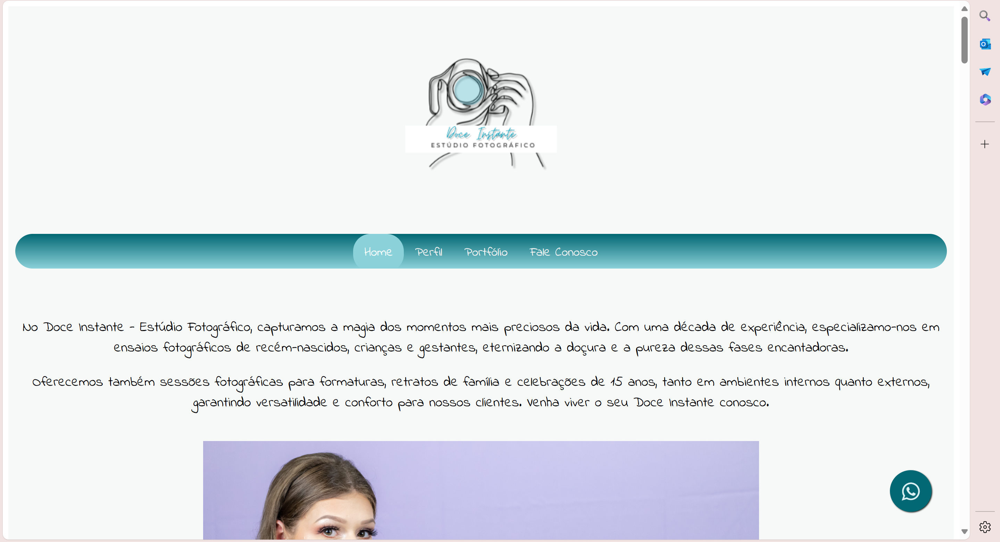
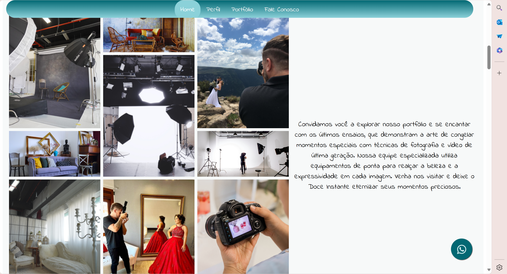
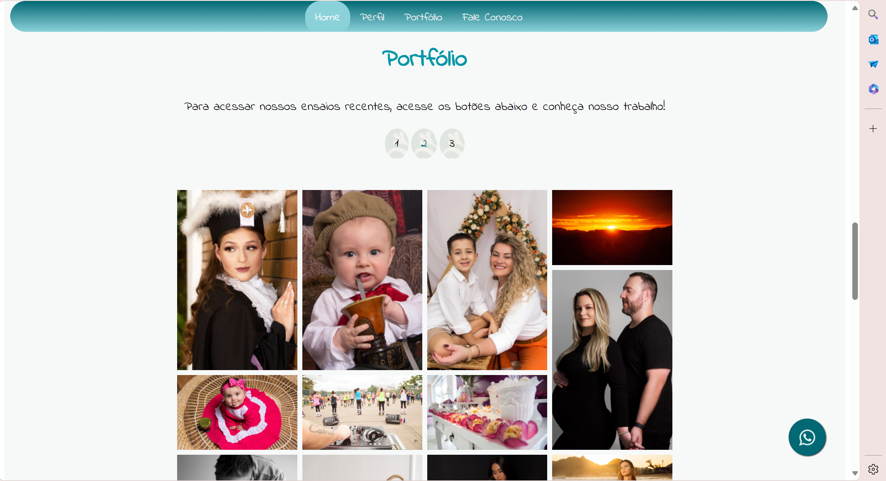
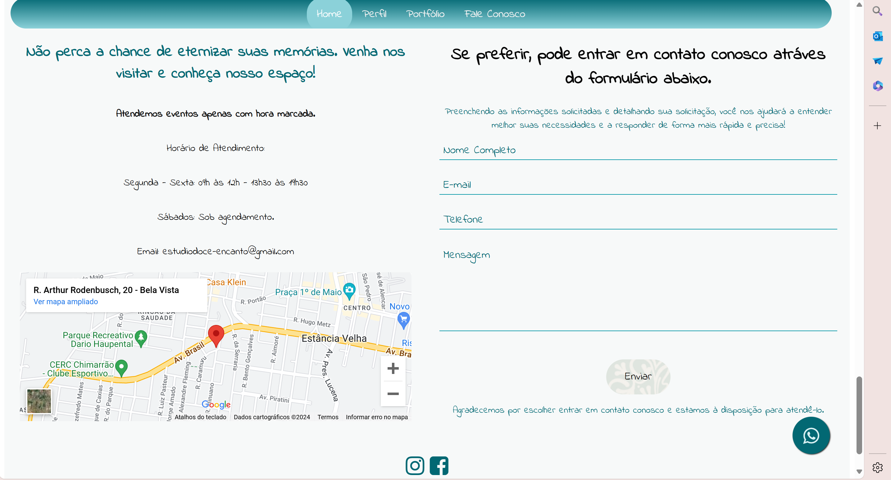
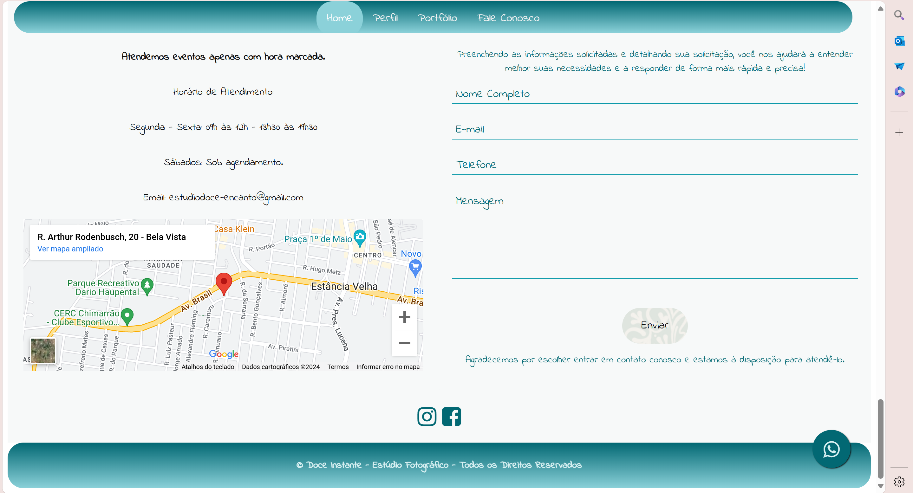

<h1>Site com Flexbox com barra de navegação fixa.</h1>

4 páginas html:
- index.html
- perfil.html.
- portfolio.html
- fale-conosco.html

1 pasta css:
- sytles.css

1 pasta JS:
- gradeimage.js
- scroll.js
- scrolltopnav.js
- topnav.js

 

 <h2>Index</h2>
 
  

  <h2>Perfil</h2>
  
   
  
  <h2>Portfólio</h2>
  
   

  <h2>Portfólio</h2>
  
   

  <h2>Fale Conosco</h2>
  
  
   
